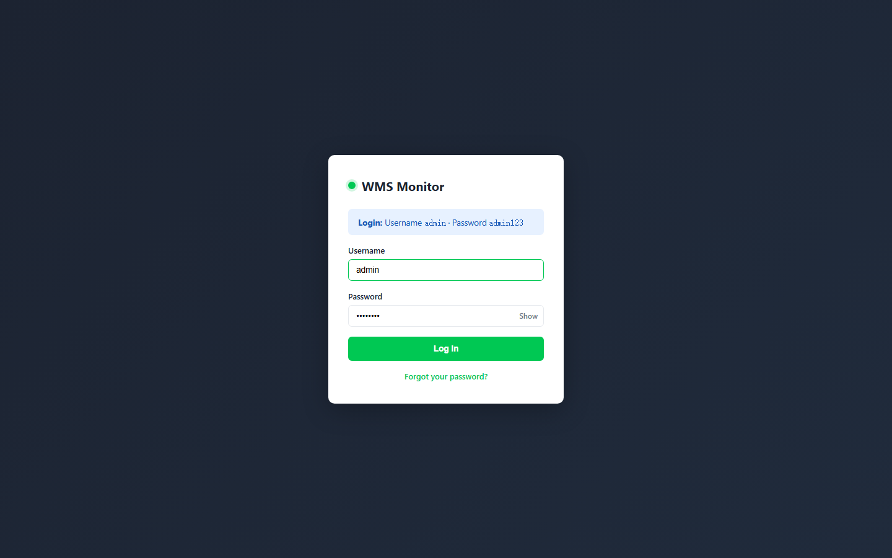
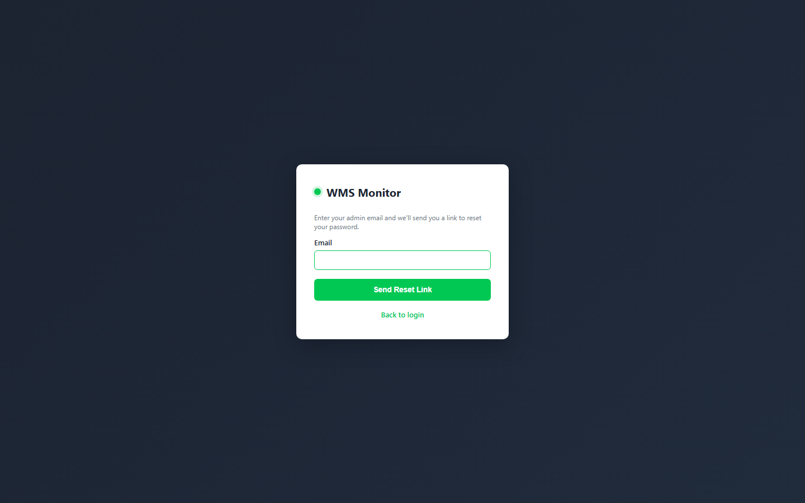
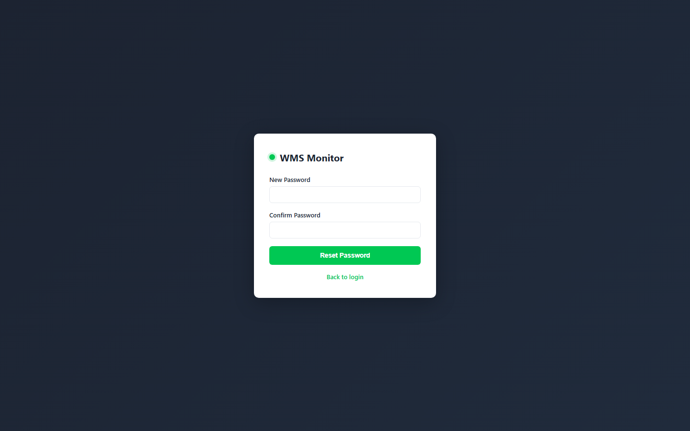
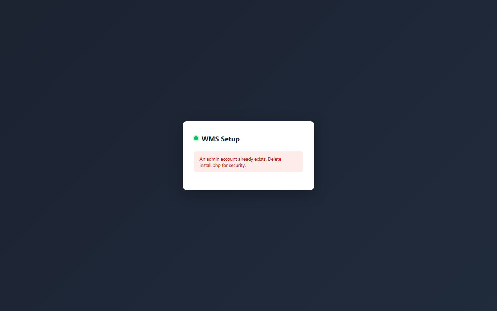
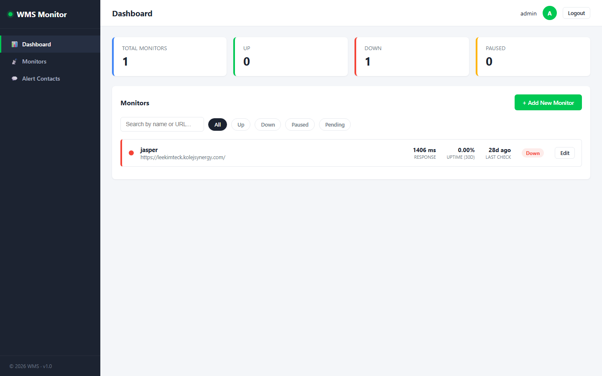
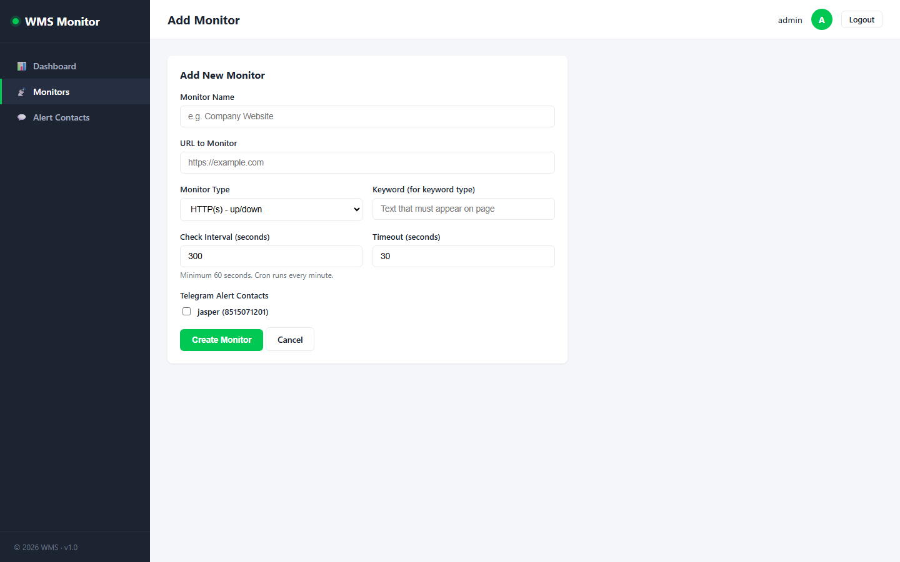
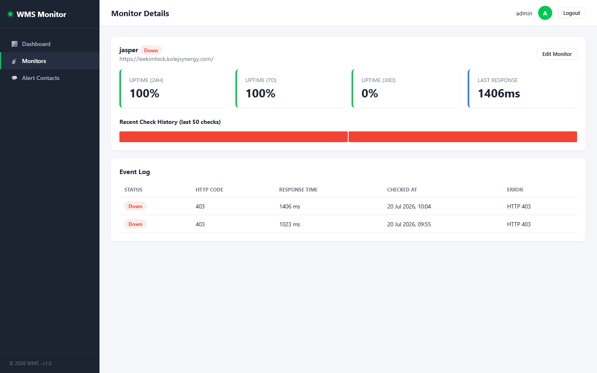
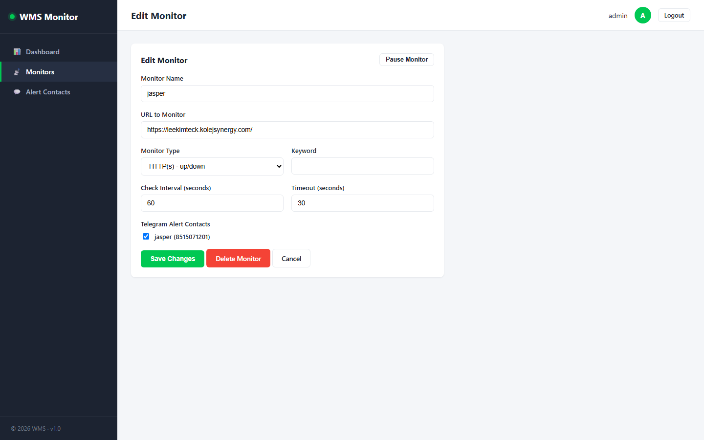
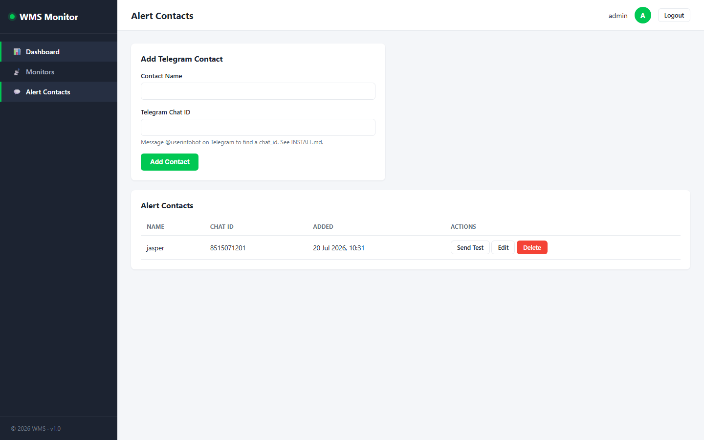
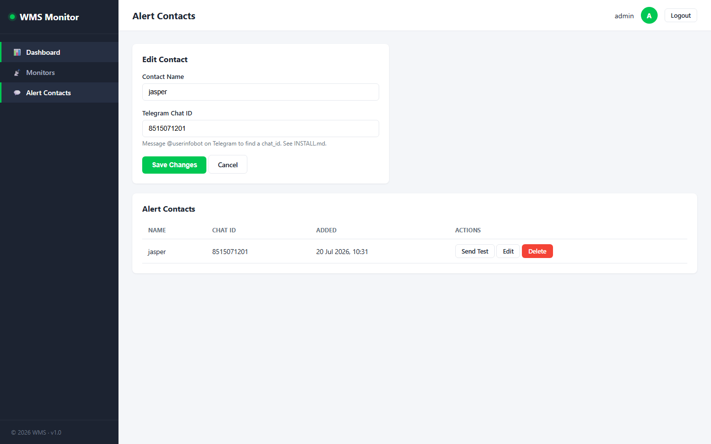

# WMS — Website Monitoring System

A self-hosted uptime monitor built with **Core PHP + MySQL**. No frameworks.

WMS checks your websites on a schedule, shows uptime and response time on a dashboard, and can send **Telegram alerts** when a monitor goes down or comes back up.

- **Live:** [https://leekimteck.kolejsynergy.com/wms/](https://leekimteck.kolejsynergy.com/wms/)
- **GitHub:** [https://github.com/jindeli71-maker/wms](https://github.com/jindeli71-maker/wms)
- **Portfolio:** [https://leekimteck.kolejsynergy.com/](https://leekimteck.kolejsynergy.com/)
- **Profile:** [https://github.com/jindeli71-maker](https://github.com/jindeli71-maker)

---

## Screenshots

### 1. Login
Admin sign-in page.



### 2. Forgot Password
Request a password reset email.



### 3. Reset Password
Set a new password from the email link.



### 4. Install / Setup
One-time admin account creation. After setup, delete `install.php`.



### 5. Dashboard
Overview of all monitors, status counts, search, and filters.



### 6. Add Monitor
Create an HTTP, keyword, or TCP ping monitor and assign Telegram contacts.



### 7. Monitor Details
Uptime (24h / 7d / 30d), response time, check history, and event log.



### 8. Edit Monitor
Update URL, interval, timeout, pause, or delete a monitor.



### 9. Alert Contacts
Add Telegram contacts and send a test message.



### 10. Edit Contact
Update a Telegram contact name or chat ID.



---

## Features

- Admin login with show/hide password
- Forgot password with SMTP email reset (1-hour token)
- Add / edit / pause / delete monitors
- Check types: **HTTP(s)**, **keyword**, and **TCP ping**
- Per-monitor interval and timeout
- Cron job checks due monitors every minute
- Uptime % (24h / 7d / 30d) and response time
- 50-check visual history bar
- Telegram alert contacts, assignable per monitor
- Auto Telegram alert on Up ⇄ Down
- Dashboard auto-refresh every 30 seconds
- Search and status filters
- PDO prepared statements, CSRF tokens, escaped output

---

## How to use

1. Open the live URL and sign in with **Username** and **Password**.
2. Use **Forgot your password?** if you are locked out.
3. Add a URL to monitor and set how often to check it.
4. Read uptime / downtime history on the monitor details page.
5. Pause a monitor during maintenance so it does not send alerts.

**Tip:** Monitor a public homepage, not a page that needs login, unless you use keyword/HTTP checks that still return 200.

---

## Tech stack

| Layer | Technology |
|-------|------------|
| Backend | PHP 7.4+ (no framework) |
| Database | MySQL / MariaDB |
| Frontend | HTML, CSS, jQuery |
| Alerts | Telegram Bot API |
| Hosting | XAMPP (local) or cPanel |

---

## Pages

| Page | File |
|------|------|
| Login | `login.php` |
| Forgot password | `forgot_password.php` |
| Install | `install.php` |
| Dashboard | `index.php` |
| Add monitor | `monitors/add.php` |
| Monitor details | `monitors/view.php` |
| Edit monitor | `monitors/edit.php` |
| Alert contacts | `contacts/index.php` |

---

## Quick start (XAMPP)

1. Copy this project to `htdocs/wms`
2. Create database `wms_db` and import `database.sql`
3. Edit `config/config.php` (database, Telegram token, SMTP)
4. Open [http://localhost/wms/install.php](http://localhost/wms/install.php) and create an admin
5. Log in at [http://localhost/wms/login.php](http://localhost/wms/login.php)
6. Run the checker every minute:
   ```
   C:\xampp\php\php.exe C:\xampp\htdocs\wms\cron\check_monitors.php your-cron-secret
   ```

Full setup (cPanel, Telegram bot, SMTP, cron): see **[INSTALL.md](INSTALL.md)**.

---

## Project structure

```
wms/
├── config/              # config.php, db.php
├── includes/            # auth, mail, telegram, layout
├── assets/css/js/       # styles + dashboard AJAX
├── monitors/            # add / edit / view / delete
├── contacts/            # Telegram contacts
├── api/                 # status polling
├── cron/                # check_monitors.php
├── docs/screenshots/    # README screenshots
├── database.sql
├── install.php
├── login.php
├── forgot_password.php
├── index.php
├── INSTALL.md
└── README.md
```

---

## License

For personal / school use.
